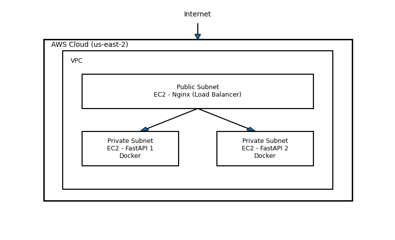

# Nginx + FastAPI Load Balancer com Terraform na AWS

Projeto demonstrando uma arquitetura simples de balanceamento de carga
utilizando **Nginx** como load balancer e múltiplas aplicações
**FastAPI** containerizadas com **Docker** em instâncias **EC2**,
provisionadas com **Terraform** na AWS.

------------------------------------------------------------------------

## Visão geral

Este projeto foi criado com foco em estudos de infraestrutura e
automação, demonstrando:

-   Provisionamento de infraestrutura com Terraform
-   Criação de VPC, subnets e instâncias EC2
-   Aplicações FastAPI containerizadas com Docker
-   Nginx como load balancer em modo round-robin
-   Estrutura modular e reutilizável no Terraform

------------------------------------------------------------------------

## Arquitetura



------------------------------------------------------------------------

## Estrutura do repositório

    .
    ├── provider.tf
    ├── modules.tf
    ├── variables.tf
    ├── locals.tf
    ├── terraform.tfvars
    ├── modules
    │   ├── network
    │   │   └── output.tf
    │   └── ec2
    │       ├── instance.tf
    │       └── sg.tf
    └── fastapi-app
        ├── src
        │   └── app.py
        ├── guia-loadbalancer-fastapi-nginx.md
        └── README.md

------------------------------------------------------------------------

## Pré-requisitos

-   Conta AWS configurada
-   Terraform instalado
-   AWS CLI configurado
-   Docker e Docker Compose (instalados via user_data nas EC2)

------------------------------------------------------------------------

## Como usar

### 1. Clonar o repositório

``` bash
git clone https://github.com/valdonunesg3/nginx-fastapi-loadbalancer.git
cd nginx-fastapi-loadbalancer
```
> [!NOTE]
> A maioria dos parâmetros ajustáveis está comentada nos arquivos do projeto, como região, bucket do tfstate, chave SSH e tamanho de disco.  
> Esses valores variam conforme a infraestrutura desejada.  
> O objetivo foi automatizar o máximo possível via `terraform.tfvars`.  
> O projeto seguirá sendo aprimorado conforme a evolução dos estudos.
 
-------------------------------------------------------------------------------------------
### 2. Ajustar variáveis

Edite o arquivo:

    terraform.tfvars


------------------------------------------------------------------------

### 2. Inicializar o Terraform

``` bash
terraform init
terraform fmt --recursive
terraform validate
```

------------------------------------------------------------------------

### 3. Planejar a infraestrutura

``` bash
terraform plan -out=tfplan
```

------------------------------------------------------------------------

### 4. Aplicar a infraestrutura

``` bash
terraform apply -auto-approve
```

Isso irá criar:

-   VPC
-   Subnets
-   Security groups
-   Instâncias EC2

------------------------------------------------------------------------

## Configuração das aplicações

Após a criação das instâncias:

1.  Acesse as EC2 das aplicações.
2.  Siga o guia:

    fastapi-app/guia-loadbalancer-fastapi-nginx.md

Esse guia cobre:

-   Build e execução do container FastAPI
-   Uso da variável `INSTANCE_NAME`
-   Configuração do Nginx como load balancer

------------------------------------------------------------------------

## Teste do balanceamento

1.  Acesse o IP público da instância do Nginx.
2.  Atualize a página algumas vezes.

A resposta deverá alternar entre as instâncias, por exemplo:

``` json
{ "instance": "docker1" }
{ "instance": "docker2" }
```

------------------------------------------------------------------------

## Destruir a infraestrutura

``` bash
terraform destroy
```

------------------------------------------------------------------------

## Melhorias futuras

-   Substituir Nginx manual por **AWS Application Load Balancer (ALB)**
-   Adicionar HTTPS com Let's Encrypt
-   Implementar pipeline de CI/CD
-   Health checks automáticos
-   Auto Scaling

------------------------------------------------------------------------

## Autor

**Rosivaldo Nunes**\
Projeto para estudos de infraestrutura em nuvem, Docker e Terraform.
