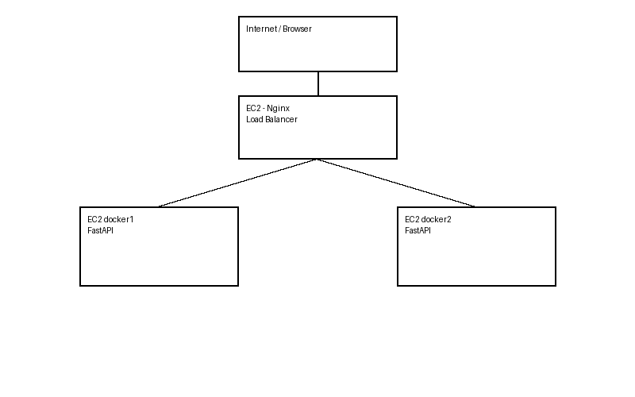

# Nginx Load Balancer with FastAPI on AWS EC2

## Overview
This project demonstrates a simple and practical load balancing architecture using:

- AWS EC2 instances
- Docker containers
- FastAPI application
- Nginx as a load balancer

The objective is to simulate a high-availability environment where requests are distributed between multiple backend servers.

---

## Architecture



**Flow:**

1. The client accesses the Nginx Load Balancer.
2. Nginx distributes requests between two FastAPI instances.
3. Each instance returns its identifier, proving load balancing.

---

## Components

### 1. Load Balancer
- EC2 instance
- Nginx running in Docker
- Listens on port 80
- Distributes requests using round-robin

### 2. Backend Instances
- Two EC2 instances
- Each runs the same FastAPI application in Docker
- Exposes port 8000
- Identifies itself using an environment variable

---

## Technologies Used

- AWS EC2
- Docker & Docker Compose
- FastAPI
- Uvicorn
- Nginx

---

## Project Structure

```
.
├── fastapi-app
│   ├── Dockerfile
│   ├── docker-compose.yml
│   └── src
│       ├── app.py
│       └── requirements.txt
│
├── nginx-lb
│   ├── docker-compose.yml
│   └── nginx.conf
│
└── architecture-diagram.png
```

---

## How to Run

### 1. On backend EC2 instances

```bash
docker compose up -d --build
```

### 2. On load balancer EC2

```bash
docker compose up -d
```

---

## Testing

Open the browser:

```
http://LOAD_BALANCER_PUBLIC_IP
```

Refresh the page multiple times.

You should see responses alternating between:

```
"instance": "docker1"
```
and
```
"instance": "docker2"
```

---

## What This Project Demonstrates

- Containerized application deployment
- Load balancing with Nginx
- Multi-instance architecture
- Basic high-availability design
- Infrastructure concepts used in production environments

---

## Possible Improvements

- Use AWS Application Load Balancer (ALB)
- Add HTTPS with Let's Encrypt
- Deploy using Terraform
- Add health checks
- Integrate CI/CD pipeline

---

## Author

Rosivaldo Nunes
